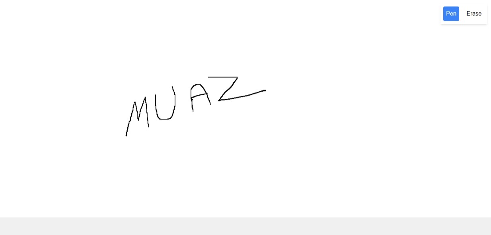

# My Art Board

An interactive art-board built using React (Vite) where users can draw and erase seamlessly. This project was developed as part of a Frontend App Challenge given by Fringecore.

## Screenshot




## Features

### 1. Clean Canvas Interface
- Upon opening the application, users are greeted with a blank white canvas.
- Two tools are available at the top:
  - **Pen Tool (🖊️)**: For drawing
  - **Eraser Tool (🧹)**: For erasing

### 2. Drawing Functionality
- Activate drawing mode by clicking the pen tool.
- Hold down the mouse button to draw on the canvas.
- Continuous lines are created by moving the mouse while holding the button.
- Release the mouse button to stop drawing.

### 3. Erasing Functionality
- Activate erasing mode by clicking the eraser tool.
- Hold down the mouse button to erase parts of the drawing.
- Lines under the eraser's path will be removed.
- The eraser shows a visible indicator of its area for precision.

### 4. No External Drawing Libraries
- Built using basic HTML5 canvas API without external drawing or canvas libraries.
- Styled using **Tailwind CSS** for a clean and modern interface.

## Technologies Used
- **React** (with Vite): For building the frontend.
- **HTML5 Canvas API**: For drawing and erasing functionality.
- **Tailwind CSS**: For styling.

## Installation

### Prerequisites
Ensure you have the following installed:
- **Node.js** (v14 or higher)
- **npm** or **yarn**

### Steps
1. Clone the repository:
   ```bash
   git clone https://github.com/muaz64/my-art-board.git
   ```
2. Navigate to the project directory:
   ```bash
   cd my-art-board
   ```
3. Install dependencies:
   ```bash
   npm install
   # or
   yarn install
   ```
4. Start the development server:
   ```bash
   npm run dev
   # or
   yarn dev
   ```
5. Open your browser and navigate to `http://localhost:5173` to view the app.

## Usage
- **Drawing**: Select the pen tool and click and drag on the canvas to draw.
- **Erasing**: Select the eraser tool and click and drag to erase parts of the drawing.

## Folder Structure
```
my-art-board
├── public          # Static files
├── src
│   ├── components  # React components (Pen, Eraser, Canvas)
│   ├── App.jsx     # Main app component
│   ├── main.jsx    # React entry point
│   └── styles.css  # Tailwind CSS styles
├── index.html      # HTML template
├── package.json    # Project dependencies and scripts
└── README.md       # Project documentation
```

## Future Enhancements
- Add a color picker for the pen tool.
- Include an undo/redo functionality.
- Save and load drawings.

## License
This project is licensed under the MIT License. See the `LICENSE` file for more details.

## Acknowledgments
This project was created for the Fringecore Frontend App Challenge.
